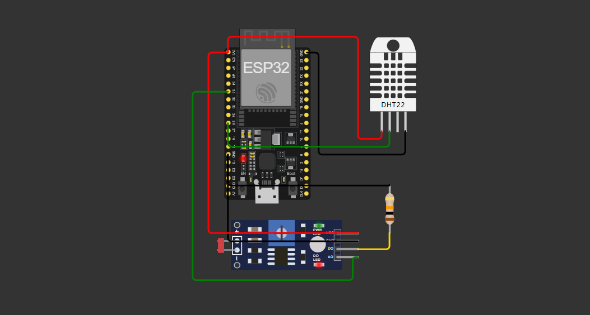
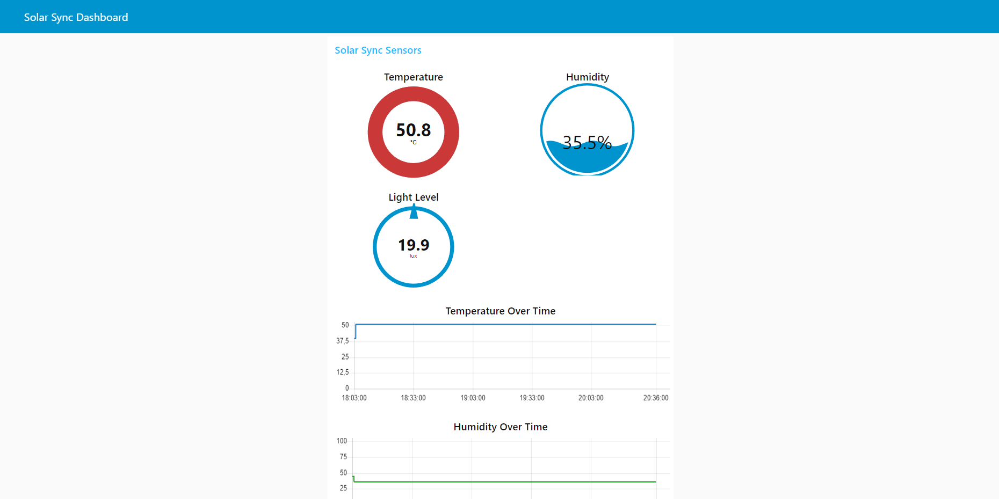

# SolarSync IoT - Sistema de Monitoramento Solar 🌞



## Sobre o Projeto 📋

O SolarSync IoT é parte de uma plataforma maior que conecta clientes e fornecedores de soluções em energia solar. Este componente específico é responsável pelo monitoramento em tempo real da eficiência das placas solares e condições ambientais, permitindo otimizar a produção de energia.

### Funcionalidades Principais ⚡

-   Monitoramento de luminosidade solar
-   Medição de temperatura ambiente
-   Acompanhamento de níveis de umidade
-   Dashboard em tempo real
-   Comunicação via protocolo MQTT

## Tecnologias Utilizadas 🛠️

-   ESP32 (Microcontrolador)
-   Sensor DHT22 (Temperatura e Umidade)
-   Sensor LDR (Luminosidade)
-   Node-RED (Gateway e Dashboard)
-   Protocolo MQTT (Comunicação)
-   Broker HiveMQ (Servidor MQTT)

## Arquitetura do Sistema 🏗️

```
[Sensores (ESP32)] → [MQTT] → [Node-RED] → [Dashboard]
```

## Software 💻

### ESP32 Sketch

O código fonte está disponível no arquivo `solarsync.ino`

### Node-RED Flow

O fluxo do Node-RED está disponível no arquivo `dashboard-solar-sync.json`

### Dashboard



## Demonstração 📺

link do video: https://youtu.be/fNW4cQmwKKI

## Instalação e Configuração ⚙️

### Simulador Wokwi

1. Acesse [Wokwi](https://wokwi.com/)
2. Crie um novo projeto ESP32
3. Copie o código do arquivo `solarsync.ino`
4. Copie o conteúdo do `diagram.json`
5. Execute a simulação

### Node-RED

1. Importe o arquivo `dashboard-solar-sync.json`
2. Configure o broker MQTT (HiveMQ)
3. Dê deploy no fluxo
4. Acesse o dashboard

## Contribuidores 👥

<table>
  <tr>
    <td align="center">
      <a href="https://github.com/nichol6s">
        <br>
        <sub>
          <strong>Nicholas Santos</strong>
        </sub>
      </a>
    </td>
    <td align="center">
      <a href="https://github.com/VitorKubica">
        <br>
        <sub>
          <strong>Vitor Kubica</strong>
        </sub>
      </a>
    </td>
    <td align="center">
      <a href="https://github.com/DuduViolante">
        <br>
        <sub>
          <strong>Eduardo Violante</strong>
        </sub>
      </a>
    </td>
    <td align="center">
      <a href="https://github.com/pedrocpacheco">
        <br>
        <sub>
          <strong>Pedro Pacheco</strong>
        </sub>
      </a>
    </td>
    <td align="center">
        <a href="https://github.com/biasvestka">
        <br>
        <sub>
            <strong>Beatriz Svestka</strong>
        </sub>
      </a>
    </td>
  </tr>
</table>
